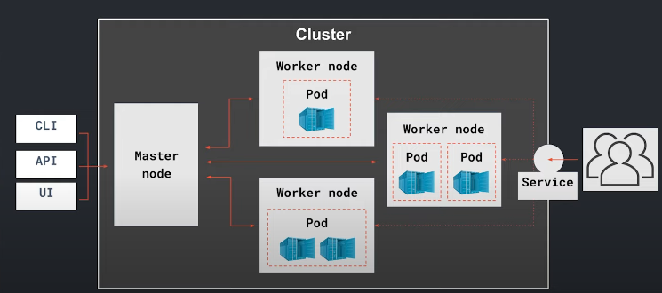

# За пределами контейнеров
## Ansible
Итак, наши программы должны оказаться на продовом сервере. Какой путь?
- Мы зворачиваем в коробку (docker build)
- Отправляем на сервер
- Разворачиваем на сервере (docker run)

А что с отправкой на сервер?
- Скопировать вручную на сервер (scp, rsync) - сгодится только для pet-проектов или приложений, работающих в армках одного сервера. В современном мире такой способ доставки не используется. Но и тут странно получается, мы переносим все файлы на сервер, собираем ее там и запускаем (равносильно тому, что почтальен принесет нам посылку и при нас же ее упакует перед вручением)
- Докер-репозиторий: собрали программу в образ, запушили в репозиторий, оттуда стянули образ на сервер и запустили. Здесь мы решили проблему с прекращением сборки на сервере, но не решили проблему нескольких серверов.
- Ansible - SCM (system configuration management) - приложение для удаленного управления конфигурациями. Что-то делаем на сервере не заходя в него. Конфигурация описывается в YAML формате. Условно получается так, мы локально собрали образ, запушили его. А затем запускаем ansible, который идет по серверам и поднимает контейнеры с приложениями.

Посмотрим пример см. папку ansible:

Важно обратить внимание на то, что nginx.conf лежит рядом с Dockerfile. С ними мы уже знакомы, но кроме них здесь есть файлы inventory и palybook.yaml.

Задача сейчас - попасть на удаленный сервер, только делаем это локально (сами не переходим на сервер, ansible сам пойдет на сервер).

Собираем образ, но называем его так, как он будет называться на docker.hub:
```bash
docker build -t kcoursedocker/frontend-demo:v1 .
```

Теперь отправим его на docker.hub:
```bash
# Логинимся в docker.hub локально, вводим логин и пароль после этой команды
docker login

# Запушим
docker push kcoursedocker/frontend-demo:v1
```

А как теперь это отправить на сервер? Переходим к ansible. Для ansible в самом простом случае, мы заводим 2 файлика: inventory и playbook.yaml:
- **invetory** - это место, где мы описываем наши сервера (на какие сервера надо сходить) (в файле [production] - это секция, а ниже доме/ip или несколько серверов, также может быть несколько секций).
- **playbook.yaml** - файл, где мы описываем задачи. Здесь мы отпарвялем файлик на сервер и поднимаем контейнер. Структура простая, в реальных проектах сложнее, но принцип соверешнно такой же.

Запускаем ansible:
```bash
asnible-playbook -i inventory playbook.yaml
```

Если еще раз запустить эту команду, то ansible сначала посмотрит на сервер и увидит, что там все есть и не будет скачивать. Если удалить nginx.conf на сервере и запустить ansible, то он только восстановит этот файл.

Еще одна фишка ansible - позволяет хранить секретные данные: файл **credentials.yaml**
```bash
ansible-vault encrypt credentials.yaml
# Вводим какой-нибудь пароль
```
Теперь наш конфиг с токенами закодировался, теперь такое можно выложить и на гитхаб.
Можно посмотреть раскодированные токены командой view:
```bash
ansible-vault view credentials.yaml
# Вводим указанный ранее пароль
```
Или раскодировать:
```bash
ansible-vault decrypt credentials.yaml
# Вводим указанный ранее пароль
```

## CICD continuous integration & continuous deployment
Комбинация непрерывной интеграции и развертывания. Представим: процесс разработки, тестирования, сборки и деплоя приложения отвечаем мы сами - делаем вручную. А теперь сделаем так, что руками ведем только процесс разработки, а все остальное автоматизированно. У нас будет некоторое место, где будет находится наш код, допустим github, в нем у нас будем самая главная ветка - master (продовый код). Разработчики берут код из мастера и кладут в свою ветку, а когда они поработали эту ветку они пушат на гитхаб (влив ее в мастер). А как этот код доставить до прода? 

На примере простого приложения попробуем его задеплоить вот таким образом. Для этого вспользуемся gitlab CICD. Также существуют и другие Github Actions, Jenkins и другие.

Создаем репозиторий на гитлабе. Переходим в Settings - General - Repository. Ищем Merge requests - Merge commit и Protected branches.
- Protected branches - указываем, что никто не может пушить код в эту ветку (master). А как туда попадут изменения? - Через merge.
- Merge requests - как файлы будут попадать в мастер: Piplines must succeed - запуск проверок при вливании в мастер.

Итак, откроем файл **app.py** и изменим у него строчку:
```python
@app.route("/test", methods=["GET"])
# на
@app.route("/", methods=["GET"])
```
Проверим в какой ветке мы находимся - master.
```bash
git branch
```

Теперь добавим изменения в git:
```bash
git add -A
git commit -m 'new feature'
git push 
```

Получим сообщение о том, что нам нельзя пушить в эту ветку. Откатим наш коммит:
```bash
git reset --hard HEAD~
```

Сделаем новую ветку этого мастера:
```bash
git checkout -b igor/my_feature
git branch
# Увидим, что мы теперь в новой ветке
```

Теперь снова добавим изменения в git:
```bash
git add -A
git commit -m 'new feature'
# Теперь напишем git push и git подскажет, как запушить в эту ветку
git push --set-upstream origin igor/my_feature
```

Переходим в gitlab и в merge request. Немного подождав и обновив страницу, увидим крестик и ошибку о том, что merge не прошел (код поправили, но не исправили тест). Тем самым, плохой код не попал к нам в мастер. Таким образом, мы выстроили процесс CI: у нас есть мастер, который связан с продом и мы каждый раз вливаем наши фичи и на момент вливания у нас происходят проверки, чтобы мы были уверены, что с нашим мастером все хорошо. 
Исправим нащ тест: 
```python
resp = client.get("/test")
# на
resp = client.get("/")
```

И повторим команды с git:
```bash
git add -A
git commit -m 'fix test'
# Теперь напишем git push и git подскажет, как запушить в эту ветку
git push --set-upstream origin igor/my_feature
```

Теперь все ок. Тесты прошли (видим 2 галочки) и появилась кнопка merge. Нажмем на нее, слили ветки. Теперь перейдем в gitlab в CICD -> pipelines: и видим еще какой-то процесс - тесты, сборка, пуш и деплой. Это процесс CD. А как он это делает? Для этого посмотрим файл **.gitlab-ci.yaml**, в котором мы описываем наш процесс CICD:
```YAML
stages:
    - style
    - test
    - build
    - push
    - deploy

style-test: # этап с статическим тестированием, прогоняем наш код на некоторые линтеры
    stage: style
    tags:
        - container
    before_script:
        - pip install -r requirements.txt
    script:
        - isort --check --diff src/*  # смотрит, чтобы не было неиспользуемых импортов и т.д.
        - flake8 src/* # смотрим насколько наш код соответствует PEP8
    only:  # эти тесты запускаем и на merge_requests, и на master
        - merge_requests
        - master

test: # тест функциональной части кода
    stage: test
    tags:
        - container
    before_script:
        - pip install -r requirements.test.txt
    script:
        - pytest src/test.py
    only: 
        - merge_requests
        - master

build: # Собираем образ
    stage: build
    tags:
        - demo
        - docker
    script:
        - sudo docker build -t kcoursedocker/backend-demo:v1 .
    only: 
        - master

push: # пушим его в репозиторий
    stage: push
    tags:
        - demo
        - docker
    script:
        - sudo docker login -u $DOCKER_USER -p $DOCKER_PASSWORD # эти переменные окружения задают в gitlab - CICD - variables
        - sudo docker push kcoursedocker/backend-demo:v1
    only: 
        - master

deploy:
    stage: deploy
    tags:
        - demo
        - docker
    script: 
        - sudo ansible-playbook -i inventory playbook.yaml
    only:
        master
``` 
А кто запускает все эти процессы из yml-файла? В gitlab есть ранеры (CICD->runners), которые имеют теги. То есть для ранеров может быть отдельный сервер, где запускаются все эти процессы. Так, на сервере поднят контейнер, в котором запускаются первые 2 этапа. А сборка, пуш и деплой работают на другом ранере - шел экзекьютор (например, виртуальная машина). 

Делаем проверку курлом по локалхосту и видим, что все работает. В итоге, мы получили автоматизированную систему, в которой мы только пишем код (+ пушим и мерджим), а на остальное не тратим свое время. 

## Kubernetes
В CICD вроде все здорово, но мы кое-что не учли. В больших проектах возникают сложности:
- Сервера горят
- Может потеряться соединение с дата-центром
- SLA 
- Микросервисная архитектура
- Много истансов (несколь реплик сервисов)
- Баги на проде
- Ограниченное количество ресурсов (когда наплыв посетителей, мы увеличиваем количество контейнеров с бэкендом, а например, ночью, когда никого нет, мы можем уменьшить количество контейнеров и поднять вместо них контейнер с аналитикой)
- Бекапы
- Периодические высокие нагрузки

В общем, нужна система оркестрации контейнерами - Kubernetes (K8S). Посмотрим схематично на структуру K8S:



У нас есть сервера, мы ведь хотим, чтобы наши контейнеры распределялись между серверами. На картинке 4 сервера (ноды) - из этих нод собирается кластер кубернетеса. Kubernetes, по факту, имеет доступ к разным серверам. Есть 2 типа ноды: master node и worker node. Master node - управляет worker node. На worker node находятся Pod (поды) - наименьшая единица развертывания (самый маленький объект, которым управляет kubernetes). Именно вунтри пода будет работать наш контейнер или несколько контейнеров. Точкой входа для пользователей будет Service (когда кто-нибудь откроет сайт) - load balancer (K8S сам решает, на какой менее нагруженный сервер отправить запрос пользователя). для управления K8S используется master node, чтобы задать инструкцию о том, сколько нам нужно подов, как мы будем обновляться, какпие контейнеры поднимать и т.д. Все конечно сложнее.


На мастер и воркер нодах находятся некоторые компоненты kubernetes, которые позволяют осуществить все это взаимодействие. 

Сущности K8S:
- Namespaces 
- Pod
- ReplicaSet
- Deployment - чисто с подами обычно не работают. Данная сущность позволяет более гибко настраивать поведение подов. Можем указать, как именно мы хотим обновляться (rolling/recreate update), как хотим масштабироваться или откатить изменения. 
- Services
- ConfigMaps
- Ingress
- Secrets
- Job
- CronJob
- Persistent volumes
- ... 

### Практика 

Чтобы нам самим локально потыкать kubernetes, установим minikube - нода будет всего одна. ПОднимем:
```bash
sudo minikube start --vm-driver=none
# Посмотрим статус
sudo minikube status
```

А теперь посмотрим, как нам раскатить настройки (указать что нужно несколько подов и т.д.). Для этого используется yaml-файл:
```YAML
apiVersion: apps/v1
kind: Deployment
metadata: 
    name: nginx-deployment
    labels:
        app: frontend
spec:
    replicas: 4
    strategy: 
    type: RollingUpdate
    rollingUpdate: 
    maxSurge: 50%
    maxUnavailable: 50%
selector: 
    matchLabels: 
        app: frontend
template: # здесь описываем контейнер
    metadata:
        labels:
            app: frontend
    spec:
        containers:
            - name: nginx
              image: kcoursedocker/backend-demo:v1
```

Посмотрим активные ноды и поды:
```bash
sudo kubectl get nodes
sudo kubectl get podes
sudo kubectl get deploy
```
Есть только одна нода и некоторые сущности. Неймспейсы:
```bash
sudo kubectl get ns
```

Запустим наш файл и проверим поды (увидим 4 штуки)
```bash
sudo kubectl apply -f deployment.yaml
sudo kubectl get podes
# Также создался реплика сет:
sudo kubectl get rs
# Деплой
sudo kubectl get deploy
```

Представим ситуацию, когда у нас падает сервер (в примере под):
```bash
# Включим постоянно отображение подов:
sudo watch -n 0.1 kubectl get podes
# грохнем под (укажем имя deployment+id пода):
sudo kubecl delete pods nginx-deployment-6b9db44b6-6kkf 
```

И видим, что kubernetes поднял нам новый под. Теперь сделаем изменения в yaml-файлике, изменим образ на nginx и запустим его, наблюдая при этом за подами:
```bash
sudo kubectl apply -f deployment.yaml
```
Видим, что как минимум, половина контейнеров работала. 

А теперь откатимся до предыдущей версии:
```bash
sudo kubectl apply rollout -f deployment.yaml
```
