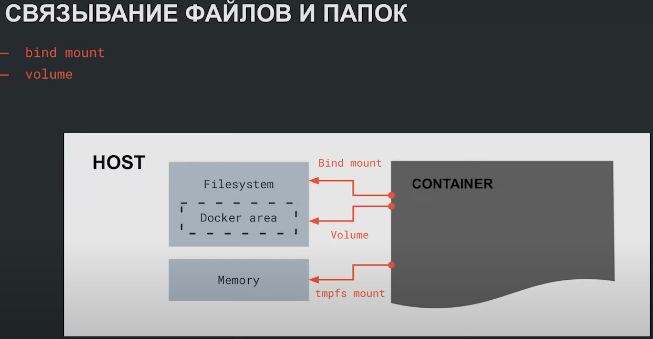

# Работа с файлами - ТЕОРИЯ


По умолчанию память контейнера изолирована от хоста. Но при помощи bind mount и volume мы можем связать файловую систему контейна с памятью хоста.

## BIND MOUNT
Если нужно присоединить к контейнеру файл с настройками, секретные токены 
- Монтирование файлов/папок, которые находятся в любом месте на хосте
- Используется, чтобы прокинуть файлы/папки в контейнер
- Нужно использовать полный путь

## VOLUME (том)
Если нужно сохранять данные из контейнера
- Монитирование папок, находящихся в специально отведенном месте (**/var/lib/docker/volumes/**)
- Используется, чтобы хранить данные из контейнера

## VOLUME VS BIND MOUNT 
- Volumes, в отличие от bind mount, не зависят от хоста (mac или windows)
- Volumes, в отличие от bind mount, более безопасны
- Volumes находятся в специально отведенном месте
- Volumes позволяют связывать только папки

## Что будет с данными, если контейнер упадет?
Данные папки контейнера и папки хоста синхронизированы, все данные останутся.

## Именованные и неименованные volume
При запуске контейнера volume можно задать явно, а есть такие образы, при разворачивании контейнера которых, volume создаются автоматически (неименованные volume).

## Как создать volume
```
docker volume create ch_data
```
Посмотреть список вольюмов:
```
docker volume ls
```

## Как монтировать вольюм к контейнеру?
```
docker run -d -v ch_data:/var/lib/clickhouse yandex/clickhouse-server
```

## Посмотреть содержимое вольюма
```
sudo ls /var/lib/docker/volumes/ch_data
```

## Посмотреть ресурсы диска
```
docker system df
```

## Пример Dockerfile с монитрованием volume
```
FROM node:17
COPY ./script.js /app/script.js
VOLUME /app
CMD ["node", "/app/script.js"]
```
При поднятии контейнера без каких-либо опций будет создан неименованный volume

# ПРАКТИКА - Телеграм бот в докере
Напишем программу, которая будет сохранять наши заметки - todo-лист.
Нужно хранилище, интерфейс. Будем использовать тг-бота, интерфейсом будет телеграм
Создадим файлы Dockerfile, .dockerigonre, .gitignore.
Создаем бота в BotFather и вставляем свой токен.

Заполним Dockerfile:
```
FROM python:3.8

WORKDIR /app

COPY requirements.txt requirements.txt
RUN python -m pip install --upgrade pip && pip install -r requirements.txt

COPY tg_bot.py tg_bot.py

ENTRYPOINT [ "python3", "tg_bot.py" ]
```

Соберем образ:
```
docker build -t tg_bot_files:1 .
```

Запустим контейнер:
```
docker run --rm --name bot tg_bot_files:1 
```

Упадем с ошибкой из-за отсутсвие todo.csv (сделали это намеренно).

## Как скопировать файл в работающий контейнер?
Запустим контейнер и войдем в него
```
docker exec -it bot bash
```
Видим, что папки и файла todo_list.csv нет.
Скопируем их в контейнер.

```
docker cp todo_result/ bot:/app
```

Но при падении контейнера мы потеряем все данные.

## BIND MOUNT
Монтируем папку в контейнер (указывая полный путь) (узнать текущий полный путь в ubuntu - ```pwd```, в windows - ```cd``` или ```pwd``` в PowerShell !!!):

Запуск в windows:
```
docker run --rm --name bot -d -v "$(pwd)/todo_result:/app/todo_result" tg_bot_files:1
```
Комментарии: 
- ```-d``` запуск в фоновом режиме, без перехвата терминала
- ```$(pwd)``` полный путь к рабочей директории, а ```$()``` - синтаксис, который позволяет выполнять команду в команде
- после : пишем путь в контейнере

Проверяем, что контейнер работает:
```
docker ps
```

Провремяем, появилась ли папка с файлом в контейнере:
```
docker exec -it bot bash
ls
# requirements.txt  tg_bot.py  todo_result
```

Добавляем через телеграм задачи,  
```
/add Купить батон
/add Купить мясо
```

затем смотрим их в контейнере
```
cat todo_result/todo_list.csv
```

и на хосте в файле todo_result/todo_list.csv

## Теперь тоже самое через VOLUME
# Немного теории
Выведем список volume:
```
docker volume ls
```

Создадим volume
```
docker volume create test_vol
docker volume create test_vol_2
docker volume create test_vol_3
```

Удалим volume
```
docker volume rm test_vol_2
```

Удалить ВСЕ НЕИСПОЛЬЗУЕМЫЕ volume
```
docker volume prune
```

# Возвращаемся к нашему боту
Создадим том:
```
docker volume create tg_4_vol
```

Посмотрим расположение тома в хосте для Linux:
```
docker volume inspect tg_4_vol
```
Для windows в строке проводника ввести и для удобства закрепить на панели:
```
\\wsl$\docker-desktop-data\data\docker\volumes
```

Теперь запустим контейнер с ботом, но теперь укажем том:
```
docker run --rm --name bot -d -v tg_4_vol:/app/todo_result tg_bot_files:1
```

ВАЖНО! Мы только создали папку todo_result в контейнере и связали ее с томом, но не добавили файл csv. Прокинем его через ```cp```:
```
docker cp todo_result/todo_list.csv bot:/app/todo_result/todo_list.csv
```

## Опасность при работе с bind mount

- Если монтировать в контейнер корневую папку системы или какой-нибудь важный файл, то при изменении/удалии этих файлов хост может упасть.
- По дефолту к контейнере мы работаем с правами суперюзера, поэтому вне контейнера достучаться к файлам созданным контейнером мы сможем только из под рута. 

## Как с этим бороться?

- Не монтировать корень (системные папки) ```/```
- При маунте папки или файла можем задать третью опцию через двоеточие ```ro``` (read only) - то есть такой файл/папку можно только читать: ```docker run -v <путь_на_хосте>:<путь_в_контейнере>:ro <образ>```
- ```--user``` при поднятии контейнера

# ИТОГ
```docker volume ls``` — вывести список вольюмов (ссылка)

```docker volume create <название>``` — создать вольюм (ссылка)

```docker volume rm <название>``` — удалить вольюм (ссылка)

```docker volume prune``` — удалить вольюмы, которые не используются контейнерами (ссылка)

Bind mount:
```docker run -v <полный_путь_на_хосте>:<полный_путь_в_контейнере> <образ>```

Volume:
```docker run -v <название_вольюма>:<полный_путь_в_контейнере> <образ>```

Readonly режим
```docker run -v <полный_путь_на_хосте>:<полный_путь_в_контейнере>:ro <образ>```

