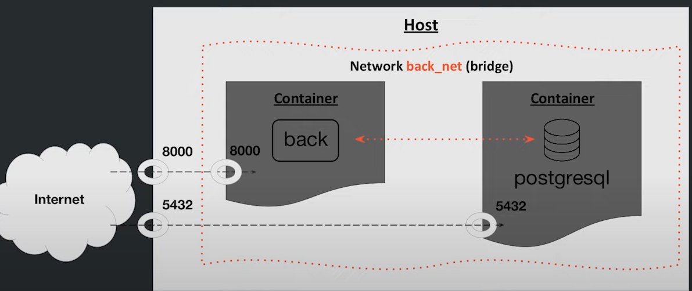

## Сети в Docker
Рассмотрим сети:
- none - Полная изоляция контейнера.
- host - Условно полностью убираем сетевую изоляцю (говорим контейнеру, что он является хостом). Контейнеры могут взаимодействовать друг с другом и с хостом
- bridge - Сеть, в которую все контейнеры попадают по умолчанию. Контейнеры находящиеся в этой сети могуь взаимодействовать друг с другом, но не с хостом. Но чтобы достучаться к ним извне, нужно прокинуть порты.

Чтобы из одного контейнера достучаться до другого, нужно обращаться не по локалхосту, а по их ip адресу (172.17.0.0/16)

## Кастомные сети
Используются для того, чтобы на основе готовы драйверов составить свою сеть для изоляции контейнеров. Контейнеры могут подключаться друг к другу, если они находятся в одной сети.

## Практика
Переведем наш проект с TODO list в веб, используя Flask и Postgres, а также вебсервер gunicorn. 
Будем хардкодить для простоты, указывая данные в коде. Но так делать не надо!

ip адрес 0.0.0.0 - говорит, что наше приложение работает на всех ip адресах, то есть и на 127.0.0.1, и на ip выданном контейнеру 172.17.0.0.1 например.

Соберем наш бэкенд:
```bash
docker build -t 6_back .
docker run --rm -d -p 8000:8000 --name back 6_back
```

Попробую дернуть наш бэкенд:
```bash
curl http://localhost:8000/test
```
Получили json: {"Test":"OK"} - все работает.

## Теперь перейдем к работе с сетями
Выведем список сетей
```bash
docker network ls
```

### Запустим наш бекенд с сетью none:
```bash
docker run --rm -d -p 8000:8000 --net=none --name back_none 6_back
```
Теперь извне дернуть наш бэкенд не получается. Попробуем сделать запрос в интернет со стороны контейнера. По умолчанию, все контейнеры имеют выходы в интернет. Но сейчас из контейнера достучаться в интернет не можем.

### Запустим наш бекенд с сетью host, не указывая порты:
```bash
docker run --rm -d --net=host --name back_host 6_back
```
Обычно, не прокидывая порты мы не можем достучаться до контейнера извне, однако сейчас мы можем дернуть наш бэкенд в контейнере с хоста. То есть полностью пропала сетевая изоляция. 

### А теперь дефолтная сеть bridge
```bash
docker run --rm -d  --name back 6_back
```
Порт не пробросили, поэтому до бэкенда не достучаться. Поднимем параллельно образ с убунту. Теперь выведем низкоуровневую инофрмацию о сети bridge:
```bash
docker inspect bridge
```
Здесь мы можем увидеть наши контейнеры и их ip адреса.
Из убунту сделаем запрос:
```bash
curl 172.17.0.2:8000/test
```
Получили ответ. То есть можем общаться между контейнерами в этой подсети. 
Но с хоста все же можно достучаться до контейнера с сетью bridge без проброшенного порта, как? Вместо localhost пишем адрес контейнера: 
```bash
curl 172.17.0.2:8000/test
```
Сработало.

## Сетевое взаимодействие в докере
Запустим образ ubuntu
```bash
docker run -it --name my_ubuntu ubuntu
```
и установим в ней программы:

```bash
apt-get update && apt-get install -y nano wget curl git
apt install -y net-tools iputils-ping
```

Теперь делаем коммит этого контейнера:
```bash
docker commit my_ubuntu custom_ubuntu:latest
```

Смотрим пакеты, которые идут пр протоколу ICMP(ping идет по этому протоколу) через сетевой интерфейс eth0:
```bash
sudo tcpdump -i eth0
```
Пинганем сервер и у себя увидим трафик:
```bash
ping 66.108.82.23
```

Теперь поднимем контейнер с катомной убунту:
```bash
docker run --rm -it custom_ubuntu
```


Рассмотрим интерфейсы:
- eth0 - ethernet - через него идет весь трафик у контейнера и хоста
- docker0 (172.17.0.1) есть у хоста, это getaway для контейнера (выполняет роль роутера)
- veth - virtual ethernet - появляется в хосте, при поднятии контейнера
- lo localhost

Важно сказать о NAT. Вот мы делаем запрос из контейнера к какому-нибудь серверу из внешней сети, но как этот сервер из внешней сети понимает кмоу он должен отвтетить, ведь адресов 172.17.0.2 очень много (стандартный адрес у контейнера). А NAT заменяет при отправлении пакетов адрес контейнера на адрес компьютера (или адрес роутера) и уже этот адерс вылетает в интернет. Ответ прилетает к нам на роутера/пк и NAT уже понимает, что входящий адрес нужно подменить на адрес контейнера, чтобы он получил ответ от сервера из внешней сети. Такая подмена адресов позволяет делать запросы в интернет из контейнера и получать ответы.

## Кастомные сети
Существет проблема с ip контейнеров. Они могут меняться при их поднятии в разном порядке. И из-за этого есть трудности с тем, как им друг к другу обращаться. Для решения этой проблемы используются кастомные сети.
Создадим свою подсеть на основе сети bridge:
```bash
docker network create back_net
```

Удалить сеть:
```bash
docker network rm back_net
```

Контейнеры из разных сетей не могут взаимодействовать друг с другом. Так мы не можем пингануть контейнер в сети back_net из контейнера, который находится в сети bridge, и наоборот. То есть каждая подсеть будет искать запрашиваемый ip у себя и не пустит его в eth0.

Теперь поднимем наш бекенд:
```bash
docker run -d --rm --name back --net=back_net 6_backend
```
А теперь запустим контейнер с убунтну в этой же сети:
```bash
docker run -d --rm --name my_ubuntu --net=back_net custom_ubuntu
```

Сделаем запрос на бекенд из под убунты
```bash
curl 172.24.0.2:8000/test
```
А теперь сделаем запрос по имени контейнера:
```bash
curl back:8000/test
```
Получили такой же ответ, теперь понимаем, что названия контейнеров принципиально важны, по ним можем обращаться из других контейнеров, а не по их ip.

## Бекенд и база данных
Выполняем команды из Commands.md.
Все работает, вот что получилось:


## Из заданий
Можно поднять контейнер и указать ему ip и port:
```bash
docker run -it --rm -d -p 127.0.0.1:80:80 --name test1 test_img
docker run -it --rm -d -p 192.168.1.182:80 --name test1 test_img
```
Подняли 2 контейнера с одинаковым портом. Это возможно, так как доступны с разных ip.

Вам нужно поднять базу данных postgres и маленькую программу.

Когда у вас это получится, в базу данных запишется ответ.

Поднимите postgres, укажите сеть и переменные окружения (пользователь, пароль и база данных). 

Затем возьмите образ kcoursedocker/task-6.4 (docker pull kcoursedocker/task-6.4:latest).

У контейнера, который будет ходить в постгрес, нужно указать следующие переменные окружения:

PG_HOST — хост (см. урок) 
PG_USER — имя пользователя, которое задается при поднятии контейнера с постгресом
PG_PASSWORD — пароль, который задается при поднятии контейнера с постгресом
PG_DATABASE — база данных, которая задается при поднятии контейнера с постгресом

Когда всё получится, контейнер выведет лог о том, что нужно сделать дальше. 

Вставьте ответ, который запишется в базу данных.

Поднимем БД
```bash
docker run --rm -d --name database --net=net -p 5432:5432 -e POSTGRES_USER=docker_app -e POSTGRES_PASSWORD=docker_app -e POSTGRES_DB=docker_app_db postgres:14
```

У приложения укажем переменные окружения при запуске:
```bash
docker run -it -d --net=net -e PG_HOST=database -e PG_USER=docker_app -e PG_PASSWORD=docker_app -e PG_DATABASE=docker_app_db --name task kcoursedocker/task-6.4:latest
```
2023-06-06 15:44:46 Отлично! Теперь зайдите в постгрес через psql, как мы делали в уроке.
2023-06-06 15:44:46 Выполните там команду: SELECT answer FROM net_task;
2023-06-06 15:44:46 Не забудть точку с запятой :)
Теперь войдем в консоль БД Postgres:
```bash
docker exec -it database psql -U docker_app docker_app_db
```
```SQL
SELECT answer FROM net_task;
```

В уроке мы подключали контейнеры только к одной сети. То есть указывали опцию --net. 

Можно ли присоединиться к нескольким сетям?

Вот вы подняли контейнер, указали --net=app, а затем хотите присоединить его к сети db_net 

(Допустим, что вы задали контейнеру имя container).

Какую команду нужно выполнить (sudo опускаем)?

```bash
docker network connect db_net container
```

Итак, вот вы подключили контейнер к двум сетям. 

Соответственно, внутри контейнера у вас будет 3 сетевых интерфейса — lo (localhost), eth0 и третий.

```bash
docker network create app
docker run -it -d --rm --net=net --name task_u custom_ubuntu
docker network connect app task_u
docker exec -it task_u bash
ifconfig
#eth1
```

