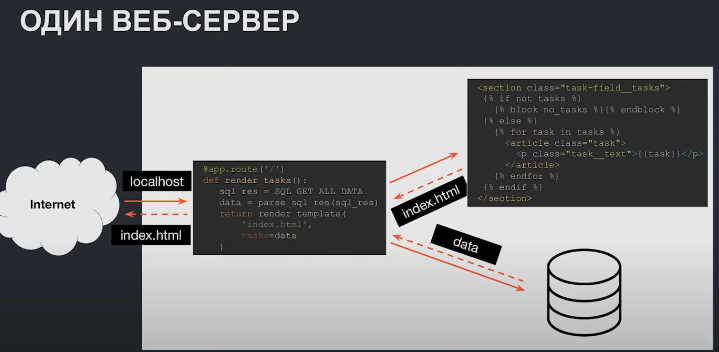
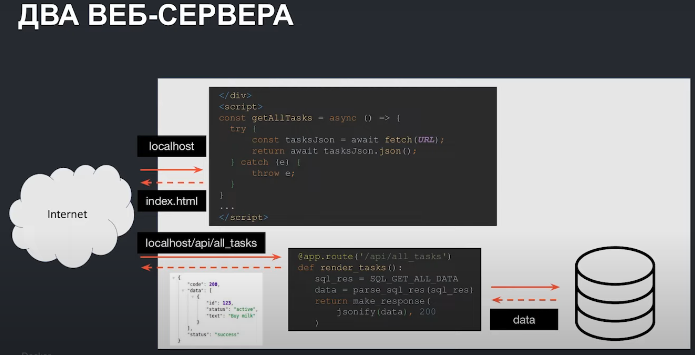
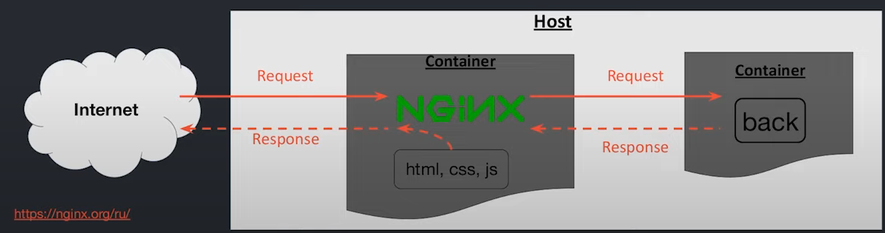
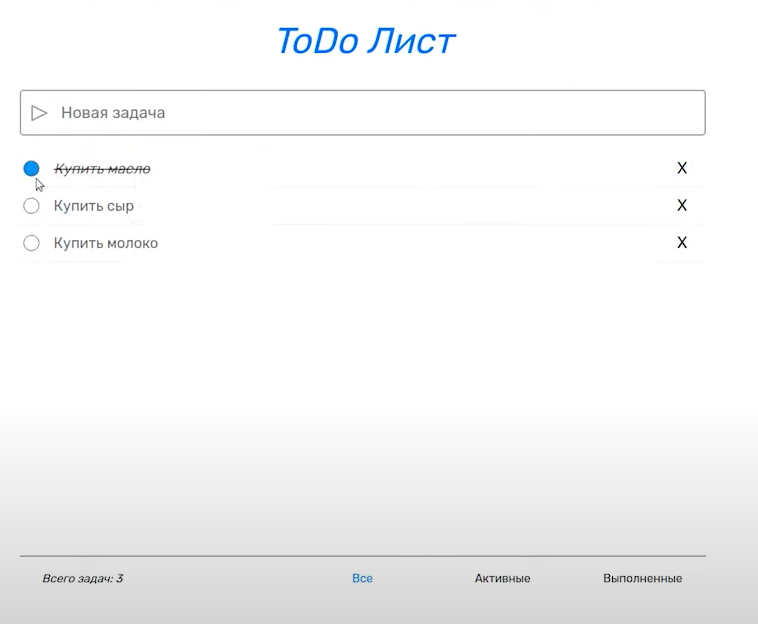
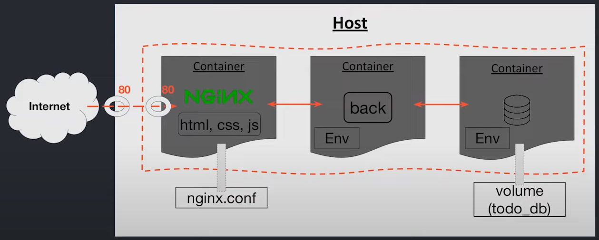

# Работа веб-приложения с одним и двумя веб-серверами
Как сделать интерфейс сайта. Как мы будем это делать?
## С одним веб-сервером


Мы могли бы использовать сам бекенд, то есть. Мы делаем запрос на наш сайт по адресу localhost. нам должна вернуться врестка и данные. Наш бекенд подхватывает этот роут и идет в БД и оттуда достает задачи. ЧТо дальше? На этом же бекенде есть папки темлейтс и статик, где хранятся статические файлы нашего сайта (html, css, js). Наш бекенд, когда возьмет данные из БД, попробует сгенерировать по шаблону какой-то финальный html-документ. И вернет полученную разметку в качестве ответа. То есть всего 1 веб-сервер. HTML, css лежат на бекенде.

## С двумя веб-серверами


Более совершенный вариант. Когда под фронтенд (статику) выделен отдельный вебсервер. В данном случае также делаем запрос на тот же локалхост, его принимает первый веб-сервер, на котором лежат html, css и js. Он отдает нам html-файл. Внутри первого веб-сервера есть запрос на бекенд. Получается, что мы под капотом, например, делаем запрос на localhost/api/all_tasks. Этот запрос попадает на второй веб-сервер, на котором крутится бекенд. Соответвенно наш бекенд сходит в БД, а затем он уже отдает не html, он будет собирать некий JSON с данными и отправлять его. Таким образом, у нас разделяется фронтенд и бекенд.

## Что мы соберем?
- Контейнер с фронтендом Nginx
- Контейнер с бекендом
- Контейнер с БД PostgreSQL

# Фронтенд Nginx
## Что такое Nginx?


Это HTTP-сервер, то есть он умеет обрабатывать HTTP-запросы. Мы будем его использовать для:
- Раздачи статических файлов (статики) (html, css и js)
- Проксирования запросов на бекенд. Что это значит? Когда мы будем делать запросы на бекенд, мы сходим не напрямую на второй веб-сервер, а сначала пройдем через Nginx. То есть мы делаем так, что сначала все запросы идут через Nginx, а Nginx уже будет решать, нужно ли по этому запросу отдать html-файл или же этот запрос нужно пропустить (проксировать на второй веб-сервер).

## Описание картинки - как работает Nginx
Мы заходим в интернет и вбиваем ссылку на наш сайт, в результате этого мы попадаем на сервер, где крутится контейнер с Nginx, бекендом и БД. Сервер по нужному порту понимает, что наш запрос нужно адресовать nginx, далле nginx смотрит на запрос и в ответ отдает файл index.html. В этом файле зашиты ссылки на файлы стилей и файлы js. Точно также делается запрос на наш сервер, который попадает опять в nginx. Тот опять смотрит на запрос и понимает, что теперь надо отдать файл style.css и script.js. Когда наш браузер прочитал полученный js он понимает, что опять нужно сделать запрос на сервер. Почнму? А все потому что в js мы первым делом дергаем ссылку на получение данных (fetch). Мы делаем еще один запрос на сервер, тот отдает его nginx. А вот теперь ситуация другая, nginx понимает, что запрос направлен на бекенд и пропускает его. В итоге этот запрос обрабаывается уже вторым веб-сервером, в результате, просыпается наш бекенд, идет в Postgres, получает из него данные и обратно по цепочке возвращается ответ.

## Файл конфигурации nginx
См. тут - [ссылка](nginx/nginx.conf)
Файл очень упрощенный. Что тут важно:
- директива ```listen``` - в ней мы указываем какой порт будем слушать - 80
- ```server_name``` - в качестве ссылки будем вводить не ip-адрес сервера, а просто домен
Следующий блок nginx связан с проксированием запросов на бекенд:
```
location /api {
            proxy_pass http://backend:8000/api;
```
В нашем фронтенде для получения, сохранения или удаления задачи будет дергаться ссылка api. Этот путь поймает Nginx и перенаправит его по адресу в бекенд с портом 8000 и роутом api: *http://backend:8000/api*. Здесь backend - это название контейнера с бекендом.

И последняя директива это путь на просто слеш:
```
location / {
            root /nginx/static;
            try_files /$base /index.html =404;
        }
```
 Здесь мы будем отдавать статику, сюда пойдет css, js и основной идекс html.

Итак, рассмотрим основные директории и особенности проекта:
- backend - все как и в прошлом уроке, только изменено подключение к БД, убран хардкод - данные тянем из переменных окружения.
- database - Dockerfile с postgresql, который расширяется скриптом init_db.sh. Данный скрипт создает нужную нам таблицу, если она еще не создана.
- frontend - это фронт, довольно сложный SPA (single page application), очень близкий к проду. Здесь также используется TypeScript, который не поддерживается браузерами. Но его нужно скомпилировать в js, который поймет браузер. И вот как в таком случае написать Dockerfile? 

Первый вариант - локально собрать css, js и index.html и добавить в контейнер. Однако при таком подходе придется постоянно пересобирать наш фронтенд перед тем как обновить образ. 

# Multi-stage build
Многоэтапная сборка - особенность Docker, которая позволяет компилировать и запускать программу в контейнере (c, c++ и т.д.). Как это работает? В Dockerfile мы как минимум задаем 2 инструкции FROM. Причем первую как-то называем. Весь смысл в том, что если мы вот так укажем инструкцию в одном Dockerfile у нас между сборками будут доступны, так называемые, артефакты, в результате мы сможем использовать файлы первой сборки во второй.

Посмотрим на примере. Многоэтапные сборки можно использовать не только для комплилируемых языков. Вот пример с питоном:
```Dockerfile
# Сборка №1 задаем исходный образ питона и эту сборку называем PARSER
FROM python AS PARSER
WORKDIR /app

COPY ./app/requirements.txt ./requirements.txt
RUN python -m pip install --upgrade pip && pip install -r requirements.txt

COPY ./*csv ./data/
COPY ./app/parse_data.py ./parse_data.py
RUN python3 ./parse_data.py # ТУт поулчаем файл result.txt - артефакт

# Сборка №2
FROM python:alpine
COPY ./app/create_report.py /app/create_report.py

# Мы копируем полученный файл из первой сборки во вторую
COPY --from=PARSER /app/result.txt /app/result.txt
ENTRYPOINT ["python3", "-u", "/app/create_report.py"]
```

В целом, очень полезный инструмент, так как позволяет значительно уменьшить конечный размерый образа. Так как, например, могут использоваться какие-то библиотеки для сборки, а в рантайме они не нужны (их можно выкинуть во второй сборке и использовать их результат работы из первой сборки).

# Сборка фронтенда
Сборка фронта и комментарии в папке frontend в файле [Dockerfile](frontend/Dockerfile).

Собираем backend, [Dockerfile](backend/Dockerfile):
```bash
docker build -t 7_back .
```

Собираем БД, [Dockerfile](database/Dockerfile):
```bash
docker build -t 7_database .
```

Собираем frontend, [Dockerfile](frontend/Dockerfile):
```bash
docker build -t 7_nginx .
```
Теперь если посмотреть список образов:
```bash
docker images
```
Обращаем внимание на 2 последних образа. Последний 7_nginx весит ~ 140 Мб и предпоследний без имени и тега весит почти 1.5 Гб. Вот и польза многоэтапной сборки, сэкономили много места на диске. 

# Веб-приложение в контейнерах

Создадим том для сохранения из БД кликхаус:
```bash
docker volume create todo_db
```

Создадим сеть
```bash
docker network create todo_net
```

Как это все запустить?
Команды и комментарии к ним смотреть в файле [Commands.md](Commands.md)

Все, наш сайт готов!
## Интерфейс сайта:


## Итоговая схема:


## Задание 1
Во время уроков мы неоднократно говорили что-то в духе «поднимем несколько бекендов». 

На данном этапе для нас уже не проблема поднять несколько контейнеров. Однако встает вопрос: «Ну подняли, а что дальше?».

Действительно, чтобы приложение работало, нужно каким-то образом (например, из того же фронтенда) уметь ходить на эти реплики бекендов.

Так что давайте на простейшем примере попробуем это реализовать. Иначе говоря, давайте используем так называемый Load Balancer (балансировщик нагрузки). Для этого будем всё также поднимать nginx.

В качестве «бекенда» возьмите вот этот образ — *kcoursedocker/task-7.1* (```docker pull kcoursedocker/task-7.1```). На его основе поднимите 3 контейнера с названиями backend_1, backend_2 и backend_3.

Затем мы используем nginx. В данном случае nginx не будет нам отдавать статику (html, css, js). Нам будет интереснее как раз посмотреть на вот это проксирование запросов. То есть мы поднимем nginx с простейшим конфигом, прокинем порт 80, а затем пойдем на localhost.

То есть nginx будет ходить на один из поднятых «бекендов».

Итого, что нужно сделать:

Создать сеть.
Поднять 3 контейнера на основе образа *kcoursedocker/task-7.1* (не забудьте задать имена контейнерам - backend_1, backend_2 и backend_3).
Взять конфиг nginx'а (см.ниже) и положить в файл **nginx.conf**.
Поднять контейнер с nginx'ом, куда сделать bind mount конфига из пункта 3.
Обратите внимание на то, как именно делается bind mount. То есть на компьютере нужно указать абсолютный (полный) путь до файла **nginx.conf**, а внутри контейнера нужно указать путь к дефолтному конфигу (*/etc/nginx/conf.d/default.conf*).

После этого зайдите на localhost, и несколько раз обновите страницу.

Чтобы реализовать такой простейший Load Balancer, используйте вот такой конфиг:
```
upstream backend {
    server backend_1:8000;
    server backend_2:8000;
    server backend_3:8000;
}

server {
    listen 80;
    server_name _;

    location / {
        proxy_pass http://backend;
    }
}
```

Вот в таком простом варианте мы сделали балансировщик, который может ходить на 3 одинаковых бекенда. 
Найдите в документации nginx'а ```ngx_http_upstream_module```.

Нам понадобится описание директивы ```server``` (у которой контекст — ```upstream```)

Какие параметры можно задать для этой инструкции?
