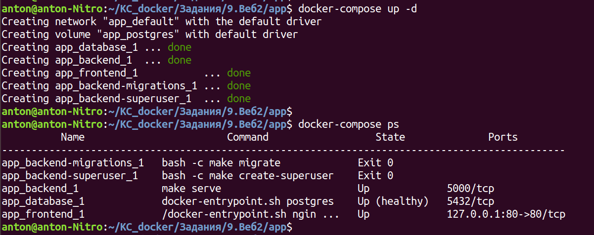

Предлагаем перейти к самому интересному!

Нам нужно будет написать свой docker-compose.yaml файл для веб-приложения.

У нас будет маленький сайт, который нужно будет завернуть в 5 сервисов.

Смысл в том, что в этом веб-приложении нужно задать еще 2 контейнера для инициализации. Первый контейнер позволит накатить миграции, а второй — создать суперпользователя. 

Первый сервис — постгрес (database). В нём нужно задать образ, переменные окружения (база данных, пользователь и пароль), можно указать вольюм и нужно задать healthcheck. В сущности то же, что и на предыдущем шаге.

Второй сервис — бекенд (backend). Тут нужно указать образ (см. дальше), переменные окружения (см. дальше) и зависимость от database.

Третий сервис — nginx (frontend). Указываем образ (см. дальше), порт и зависимость от backend и database.

Четвертый сервис — контейнер, который позволит накатить миграции (backend-migrations). Тут тот же образ, что и в бекенде. Те же переменные окружения, что и в бекенде. Задаем зависимость от backend и database.  И вот тут нужно задать инструкцию command.

Пятый сервис — контейнер, который позволит создать суперпользователя (backend-superuser). Тот же образ, что и у бекенда. Затем нужно использовать те же переменные, что и у бекенда + некоторые свои переменные окружения. Задаем инструкцию command. Наконец, этот сервис должен зависеть и от database, и от backend, и от backend-migrations.

Логика следующая — мы поднимаем базу данных, затем поднимаем бекенд и фронтенд. После того, как поднялся бекенд и развернулась база данных, нам нужно сделать миграции в базу данных. Наконец, когда в базе появились таблицы (прошли миграции), мы создаем суперпользователя.

Выглядеть это может примерно вот так:


Итак, теперь давайте подробнее про сервисы.

Нужно задать следующие сервисы:

1. database
2. backend
3. frontend
4. backend-migrations
5. backend-superuser


## Сервис database

Тут в сущности то же, что и на предыдущем шаге (кроме сервиса create-table).
Образ — postgres:14
Переменные окружения — POSTGRES_DB, POSTGRES_USER, POSTGRES_PASSWORD
Можно задать вольюм (путь внутри контейнера — /var/lib/postgresql/data)
healthcheck — укажем также только test: ["CMD-SHELL", "pg_isready", "-U", "admin"] (где -U - юзер)

## Сервис backend

Образ —  kcoursedocker/task-9.2-back:latest
Переменные окружения: 
- PG_NAME — соответствует POSTGRES_DB
- PG_USER — соответствует POSTGRES_USER
- PG_PASSWORD — соответствует POSTGRES_PASSWORD 
- PG_HOST — соответствует названию сервиса с базой данных (database)
Зависимость: 
- database (condition: service_healthy)

## Сервис frontend

Образ — kcoursedocker/task-9.2-front:latest
Порт
Зависимость: 
- database (condition: service_healthy)
- backend (condition: service_started)
Заметьте, поскольку в бекенде (и в backend-migrations) мы не будем делать healthcheck, нам для этих сервисов нужно указать service_started.

## Сервис backend-migrations

Образ —  kcoursedocker/task-9.2-back:latest
Переменные окружения:
- PG_NAME — соответствует POSTGRES_DB
- PG_USER — соответствует POSTGRES_USER
- PG_PASSWORD — соответствует POSTGRES_PASSWORD
- PG_HOST — соответствует названию сервиса с базой данных (database)
- ```command — bash -c "make migrate"```
Зависимость:
- database (condition: service_healthy)
- backend (condition: service_started)

## Сервис backend-superuser

Образ — kcoursedocker/task-9.2-back:latest
Переменные окружения:
- PG_NAME — соответствует POSTGRES_DB
- PG_USER — соответствует POSTGRES_USER
- PG_PASSWORD — соответствует POSTGRES_PASSWORD
- PG_HOST — соответствует названию сервиса с базой данных (database)
- DJANGO_SUPERUSER_USERNAME — логин суперпользователя
- DJANGO_SUPERUSER_PASSWORD — пароль суперпользователя
- DJANGO_SUPERUSER_EMAIL — почта суперпользователя
- ```command — bash -c "make create-superuser"```

Зависимость:
- database (condition: service_healthy)
- backend (condition: service_started)
- backend-migrations (condition: service_started)

Итого. Если переводить это в JSON, то должно получиться что-то в таком духе:
```JSON
{
  "version": "3",

  "services": {
    "database": {
      "image": "postgres:14",
      "environment": {
        "POSTGRES_DB": "todo_list",
        "POSTGRES_USER": "admin",
        "POSTGRES_PASSWORD": "admin"
      },
      "volumes": [
        "postgres:/var/lib/postgresql/data"
      ],
      "healthcheck": {
        "test": ["CMD-SHELL", "pg_isready", "-U", "admin"]
      }
    },

    "backend": {
      "image": "kcoursedocker/task-9.2-back:latest",
      "environment": {
        "PG_NAME": "todo_list",
        "PG_USER": "admin",
        "PG_PASSWORD": "admin",
        "PG_HOST": "database"
      },
      "depends_on": {
        "database": {
          "condition": "service_healthy"
        }
      }
    },

    "frontend": {
      "image": "kcoursedocker/task-9.2-front:latest",
      "ports": [
        "127.0.0.1:80:80"
      ],
      "depends_on": {
        "database": {
          "condition": "service_healthy"
        },
        "backend": {
          "condition": "service_started"
        }
      }
    },

    "backend-migrations": {
      "image": "kcoursedocker/task-9.2-back:latest",
      "environment": {
        "PG_NAME": "todo_list",
        "PG_USER": "admin",
        "PG_PASSWORD": "admin",
        "PG_HOST": "database"
      },
      "command": "bash -c \"make migrate\"",
      "depends_on": {
        "database": {
          "condition": "service_healthy"
        },
        "backend": {
          "condition": "service_started"
        }
      }
    },

    "backend-superuser": {
      "image": "kcoursedocker/task-9.2-back:latest",
      "environment": {
        "PG_NAME": "todo_list",
        "PG_USER": "admin",
        "PG_PASSWORD": "admin",
        "PG_HOST": "database",
        "DJANGO_SUPERUSER_USERNAME": "admin",
        "DJANGO_SUPERUSER_PASSWORD": "admin",
        "DJANGO_SUPERUSER_EMAIL": "admin@admin.com"
      },
      "command": "bash -c \"make create-superuser\"",
      "depends_on": {
        "database": {
          "condition": "service_healthy"
        },
        "backend-migrations": {
          "condition": "service_started"
        },
        "backend": {
          "condition": "service_started"
        }
      }
    }
  },

  "volumes": {
    "postgres": null
  }
}
```
